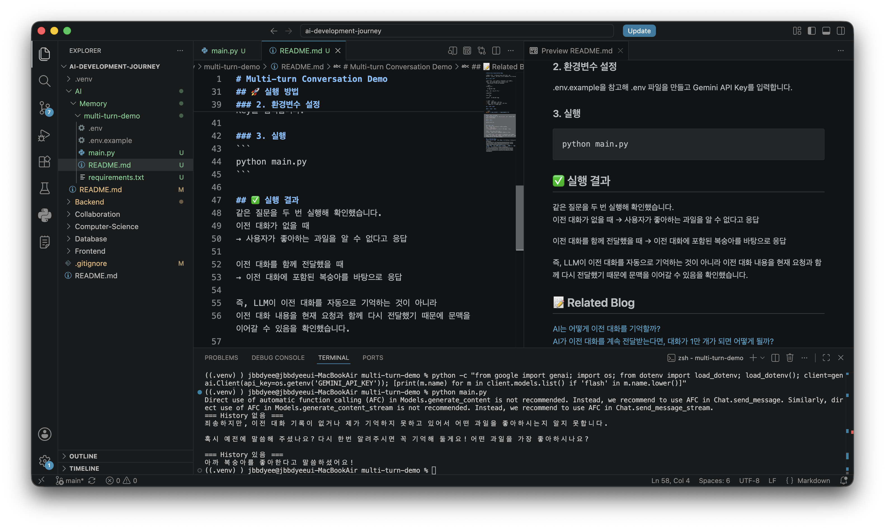

# Multi-turn Conversation Demo

LLM에게 이전 대화 기록을 함께 전달했을 때와
전달하지 않았을 때의 응답 차이를 확인하는 최소 예제입니다.

## 💡 핵심 개념

LLM이 이전 대화를 자동으로 기억하는 것이 아니라,
이전 대화 내용을 다시 함께 전달함으로써
대화의 맥락을 이어갈 수 있습니다.

```text
사용자 메시지
      ↓
대화 기록에 추가
      ↓
이전 대화 + 새로운 메시지
      ↓
LLM에 전달
      ↓
응답 생성
      ↓
응답도 대화 기록에 추가
```

🎯 확인할 내용
- 이전 대화가 없을 때의 응답
- 이전 대화를 함께 전달했을 때의 응답
- 대화가 이어지는 기본 원리

## 🚀 실행 방법

### 1. 패키지 설치

```bash
python -m pip install -r requirements.txt
```

### 2. 환경변수 설정
.env.example을 참고해 .env 파일을 만들고 Gemini API Key를 입력합니다.

### 3. 실행
```
python main.py
```

## ✅ 실행 결과



같은 질문을 두 번 실행해 확인했습니다.  
이전 대화가 없을 때
→ 사용자가 좋아하는 과일을 알 수 없다고 응답

이전 대화를 함께 전달했을 때
→ 이전 대화에 포함된 복숭아를 바탕으로 응답

즉, LLM이 이전 대화를 자동으로 기억하는 것이 아니라
이전 대화 내용을 현재 요청과 함께 다시 전달했기 때문에 문맥을 이어갈 수 있음을 확인했습니다.  

## 📝 Related Blog  
[AI는 어떻게 이전 대화를 기억할까?](https://velog.io/@jbbdyee/AI-AI%EB%8A%94-%EC%96%B4%EB%96%BB%EA%B2%8C-%EC%9D%B4%EC%A0%84-%EB%8C%80%ED%99%94%EB%A5%BC-%EA%B8%B0%EC%96%B5%ED%95%A0%EA%B9%8C-Multi-turn)  
[AI가 이전 대화를 계속 전달받는다면, 대화가 1만 개가 되면 어떻게 될까?](https://velog.io/@jbbdyee/AI-%EB%AA%A8%EB%93%A0-%EB%8C%80%ED%99%94%EB%A5%BC-AI%EC%97%90%EA%B2%8C-%EA%B3%84%EC%86%8D-%EB%B3%B4%EB%82%B4%EB%8F%84-%EA%B4%9C%EC%B0%AE%EC%9D%84%EA%B9%8C)