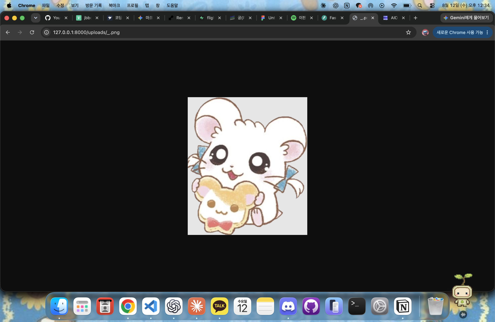

# Image Upload Demo

이미지 업로드 기능을 구현하면서 학습한 내용 중  
**이미지 파일 저장과 URL 접근 과정을 분리하여 확인하기 위한 최소 예제**입니다.

실제 프로젝트에서는 이미지 관련 정보를 데이터베이스에 저장하여 조회했지만,
이 예제에서는 핵심 동작을 확인하기 위해 데이터베이스 연결은 제외했습니다.

## 🔌 API

### 이미지 업로드

`POST /images`

이미지 파일을 업로드하면 `uploads` 폴더에 저장하고,
브라우저에서 접근할 수 있는 이미지 경로를 반환합니다.

예시 응답:

```json
{
  "filename": "sample.png",
  "image_url": "/uploads/sample.png"
}
```


## 실행 방법
```
python -m pip install -r requirements.txt  
python -m uvicorn backend:app --reload

Swagger http://127.0.0.1:8000/docs
```

## 실행 결과

- Swagger에서 이미지 업로드 성공
- uploads 폴더 자동 생성 확인
- 반환된 URL로 이미지 조회 성공



## 📝 Related Blog

이 예제를 만들게 된 실제 학습 과정과 트러블슈팅은 아래 글에 정리했습니다.

👉 [DB에 이미지 경로가 있는데 왜 화면에는 이미지가 보이지 않을까?](https://velog.io/@jbbdyee/Troubleshooting-DB%EC%97%90-%EC%9D%B4%EB%AF%B8%EC%A7%80-%EA%B2%BD%EB%A1%9C%EA%B0%80-%EC%9E%88%EB%8A%94%EB%8D%B0-%EC%99%9C-%ED%99%94%EB%A9%B4%EC%97%90%EB%8A%94-%EC%9D%B4%EB%AF%B8%EC%A7%80%EA%B0%80-%EB%B3%B4%EC%9D%B4%EC%A7%80-%EC%95%8A%EC%9D%84%EA%B9%8C)