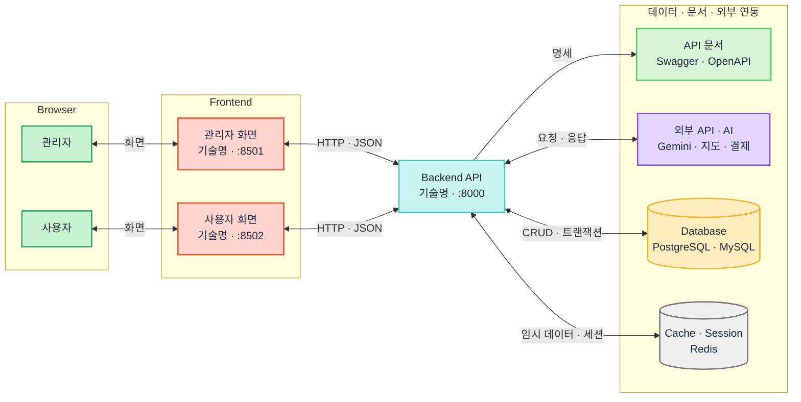
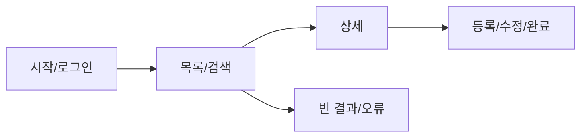
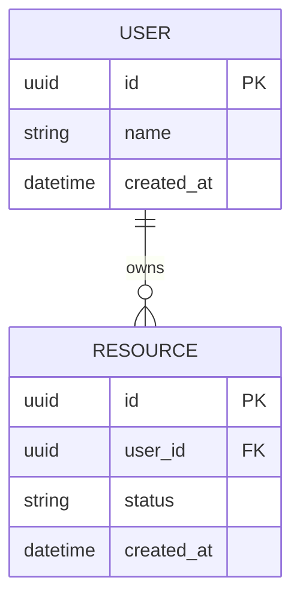

# 팀프로젝트 개발 계획서 템플릿

> 이 문서는 팀프로젝트를 위한 범용 템플릿이다.
>
> - `[필수 입력]`, `<예시>` 문구를 프로젝트 내용으로 바꾼다.
> - 안내문과 필수 요구사항을 먼저 확인한 뒤 작성한다.
> - 구현하지 않을 기능까지 계획서에 남기지 않는다.
> - 모든 핵심 기능에 담당자, 완료 기준, 테스트 방법을 연결한다.
> - 해당하지 않는 선택 항목은 과감히 삭제한다.

---

## 0. 프로젝트 기본 정보

| 항목 | 내용 |
|---|---|
| 과정명·기수 | `[필수 입력]` |
| 프로젝트명 | `[필수 입력]` |
| 팀명 | `[필수 입력]` |
| 팀원 | `[이름 1, 이름 2, 이름 3 ...]` |
| 프로젝트 기간 | `YYYY-MM-DD ~ YYYY-MM-DD` |
| 발표·제출일 | `YYYY-MM-DD` |
| Git 저장소 | `[URL]` |
| 배포 주소 | `[선택: URL]` |
| 디자인·문서 링크 | `[선택: Figma, Notion, Drive 등]` |
| 문서 버전 | `v0.1` |

### 문서 변경 이력

| 버전 | 날짜 | 작성자 | 변경 내용 |
|---|---|---|---|
| v0.1 | YYYY-MM-DD | `[이름]` | 최초 작성 |
| v0.2 | YYYY-MM-DD | `[이름]` | AI / LLM / Agent 설계 항목 추가 |

---

## 1. 과제 조건 확인

### 필수 요구사항

| 구분 | 필수 조건 | 우리 팀 반영 위치 | 담당자 | 확인 |
|---|---|---|---|---|
| 필수 기술 | `[예: Python, FastAPI, DB, 외부 API]` | `[기능/파일]` | `[이름]` | [ ] |
| 필수 기능 | `[예: CRUD, 인증, 검색]` | `[기능명]` | `[이름]` | [ ] |
| 필수 산출물 | `[예: 계획서, ERD, 발표자료, 소스 코드]` | `[저장 경로]` | `[이름]` | [ ] |
| 발표 조건 | `[시간, 시연 필수 여부]` | `[발표 순서]` | `[이름]` | [ ] |
| 제출 방식 | `[LMS, GitHub, 압축 파일 등]` | `[제출 담당/경로]` | `[이름]` | [ ] |
| 기타 제한 | `[주제, 데이터, 라이브러리, 팀 규칙]` | `[대응]` | `[이름]` | [ ] |

---

## 2. 프로젝트 개요

### 2-1. 프로젝트명

`[프로젝트명]`

### 2-2. 한 줄 소개

> `[대상 사용자]`가 `[겪는 문제]`를 해결할 수 있도록 `[핵심 기능/가치]`를 제공하는 `[서비스 종류]`이다.

### 2-3. 기획 배경과 문제

- 대상 사용자가 겪는 상황: `[입력]`
- 해결하려는 핵심 문제: `[입력]`
- 기존 방식의 불편함: `[입력]`
- 이 주제를 선택한 이유: `[입력]`

### 2-4. 프로젝트 목표

| 목표 | 완료됐다고 판단할 기준 | 확인 방법 |
|---|---|---|
| `[목표 1]` | `[측정하거나 시연할 수 있는 기준]` | `[테스트/시연]` |
| `[목표 2]` | `[기준]` | `[확인 방법]` |

### 2-5. 대상 사용자

| 사용자 유형 | 특징 | 원하는 것 | 사용할 기능 |
|---|---|---|---|
| `[일반 사용자]` | `[상황/특징]` | `[요구]` | `[기능]` |
| `[관리자/운영자]` | `[상황/특징]` | `[요구]` | `[기능]` |

### 2-6. 핵심 사용자 시나리오

1. `[사용자]`가 `[서비스 진입/가입]`을 한다.
2. `[핵심 정보]`를 입력하거나 선택한다.
3. 시스템이 `[핵심 처리]`를 수행한다.
4. 사용자가 `[결과]`를 확인한다.
5. 필요하면 `[수정/삭제/후속 행동]`을 한다.

### 2-7. 이번 버전에서 제외할 것

- `[시간이 부족하면 제외할 부가 기능]`
- `[과정 범위를 벗어나는 기술]`
- `[데이터나 비용 문제로 구현하지 않을 기능]`

---

## 3. 기능 범위와 완료 기준

### 3-1. 주요 기능

| ID | 기능 | 사용자 가치 | 우선순위 | 담당자 | 이번 버전 |
|---|---|---|---|---|---|
| F-01 | `[기능명]` | `[사용자가 얻는 결과]` | Must | `[이름]` | Y |
| F-02 | `[기능명]` | `[사용자가 얻는 결과]` | Must | `[이름]` | Y |
| F-03 | `[기능명]` | `[사용자가 얻는 결과]` | Should | `[이름]` | Y |
| F-04 | `[기능명]` | `[사용자가 얻는 결과]` | Could | `[이름]` | N |

우선순위 기준:

- **Must**: 발표 가능한 핵심 흐름에 반드시 필요하다.
- **Should**: 핵심 기능 완성 후 구현한다.
- **Could**: 시간이 남을 때만 구현한다.
- **Won't**: 이번 프로젝트에서는 구현하지 않는다.

### 3-2. 기능별 완료 기준

| ID | 기능 | 정상 동작 기준 | 예외·빈 상태 기준 | 테스트 방법 | 담당자 |
|---|---|---|---|---|---|
| F-01 | `[기능]` | `[사용자가 끝까지 수행 가능한 상태]` | `[잘못된 입력/빈 결과 처리]` | `[수동/자동 테스트]` | `[이름]` |
| F-02 | `[기능]` | `[정상 기준]` | `[예외 기준]` | `[테스트 방법]` | `[이름]` |

### 3-3. MVP 기준

> 아래 흐름이 끝까지 동작하면 최소 발표 가능 버전(MVP)으로 본다.

`[시작 화면] → [입력/로그인] → [핵심 기능] → [결과 확인] → [수정/삭제 또는 완료]`

MVP 완료 조건:

- [ ] Must 기능이 실제 데이터 또는 합의된 샘플 데이터로 동작한다.
- [ ] 팀원이 아닌 사람도 README를 보고 실행할 수 있다.
- [ ] 핵심 흐름에서 중단되는 오류가 없다.
- [ ] 로딩, 빈 결과, 잘못된 입력, 권한 오류를 안내한다.
- [ ] 발표용 시연 데이터가 준비되어 있다.

### 3-4. 공통 품질 기준

| 구분 | 기준 | 확인 방법 |
|---|---|---|
| 사용성 | 주요 기능의 위치와 다음 행동을 쉽게 알 수 있다. | 팀원 교차 테스트 |
| 입력 검증 | 필수값·형식·범위를 검사하고 이유를 안내한다. | 정상/오류 입력 테스트 |
| 오류 처리 | 서버·DB·외부 API 실패 시 앱이 멈추지 않는다. | 실패 상황 테스트 |
| 보안 | 비밀번호·토큰·API 키가 코드와 로그에 노출되지 않는다. | 코드·Git 기록 확인 |
| 호환성 | 발표에 사용할 PC와 브라우저에서 동작한다. | 발표 환경 사전 테스트 |

---

## 4. 팀원별 역할과 협업 범위

### 4-1. 역할 분담

| 팀원 | 주 담당 | 세부 기능 | 생성·수정 파일/폴더 | 완료 조건 | 지원 업무 |
|---|---|---|---|---|---|
| `[이름]` | `[백엔드/프론트/데이터/문서 등]` | `[기능]` | `[경로]` | `[검증 가능한 기준]` | `[다른 팀원 지원]` |

### 4-2. 역할 배분 점검

- [ ] 모든 Must 기능에 책임자가 한 명 이상 있다.
- [ ] 한 파일을 여러 명이 동시에 수정하는 상황을 최소화했다.
- [ ] 특정 팀원에게 공통 파일과 통합 작업이 과도하게 몰리지 않았다.
- [ ] 각 팀원이 발표에서 설명할 수 있는 구현 영역을 맡았다.
- [ ] 결석·지연 시 대신 확인할 팀원을 정했다.

### 4-3. 필수 산출물 담당

| 산출물 | 담당자 | 포함 내용 | 완료 기준 | 저장 위치 |
|---|---|---|---|---|
| 프로젝트 계획서 | `[이름]` | 목표, 기능, 역할, 일정 | 실제 구현과 일치 | `[경로]` |
| 화면 설계서 | `[이름]` | 화면 목록, 흐름, 주요 상태 | 구현 화면과 일치 | `[경로]` |
| API 명세 | `[이름]` | 요청, 응답, 오류, 인증 | 백엔드·프론트가 같은 규격 사용 | `[경로]` |
| DB 설계서 | `[이름]` | ERD, 테이블, 관계, 제약 | 실제 DB와 일치 | `[경로]` |
| 테스트 결과표 | `[이름]` | 시나리오, 결과, 발견 오류 | Must 기능 검증 완료 | `[경로]` |
| 발표자료 | `[이름]` | 문제, 설계, 구현, 시연, 결과 | 제한 시간 내 발표 가능 | `[경로]` |
| README | `[이름]` | 설치, 실행, 기능, 팀원 | 새 환경에서 재현 가능 | `README.md` |

### 4-4. 의사소통 규칙

| 항목 | 우리 팀 규칙 |
|---|---|
| 매일 진행 공유 | `[시간/장소: 어제 한 일, 오늘 할 일, 막힌 점]` |
| 질문·도움 요청 | `[예: 30분 이상 막히면 팀 채널에 공유]` |
| 결정 방식 | `[합의/다수결/팀장 결정 기준]` |
| 회의 기록 | `[작성자와 저장 위치]` |
| 지각·결석 공유 | `[연락 방법과 인수인계 기준]` |
| 질문 취합 | `[질문 취합 담당/시간]` |

---

## 5. 기술 설계

### 5-1. 기술 스택

| 영역 | 기술·서비스 | 버전 | 사용 목적 | 선택 이유 |
|---|---|---|---|---|
| 프론트엔드 | `[기술]` | `[버전]` | `[목적]` | `[과정/프로젝트 기준]` |
| 백엔드 | `[기술]` | `[버전]` | `[목적]` | `[이유]` |
| 데이터베이스 | `[기술]` | `[버전]` | `[목적]` | `[이유]` |
| 외부 API | `[서비스]` | `[버전]` | `[목적]` | `[이유]` |
| 배포 | `[서비스]` | `-` | `[목적]` | `[이유]` |
| 협업 도구 | `[GitHub, Notion 등]` | `-` | `[목적]` | `[이유]` |

> 새로운 기술은 학습 비용과 담당자를 확인한 뒤 추가한다.

### 5-2. 시스템 구조

아래 예시는 사용자용·관리자용 화면, 하나의 백엔드, 데이터베이스, 캐시, 외부 AI/API, API 문서를 함께 표현한 구조다. 프로젝트에 없는 구성요소는 삭제하고 실제 기술명·주소로 바꾼다.



구성요소 설명:

| 구성요소 | 템플릿에 적을 내용 | 없을 때 처리 |
|---|---|---|
| Browser | 일반 사용자·관리자 등 실제 이용 주체 | 이용 주체가 하나면 하나만 남긴다. |
| Frontend | 기술명, 역할, 실행 주소·포트 | 백엔드 템플릿 렌더링이면 Backend와 합친다. |
| Backend API | 프레임워크, 핵심 책임, 실행 주소·포트 | 서버가 없다면 삭제한다. |
| API 문서 | Swagger, OpenAPI, Postman 등 확인 방법 | API가 없으면 삭제한다. |
| Database | DB 종류와 저장하는 핵심 데이터 | 영구 저장이 없으면 삭제한다. |
| Cache/Session | Redis, 메모리 캐시, 세션의 용도 | 사용하지 않으면 삭제한다. |
| 외부 API/AI | Gemini, 지도, 날씨, 결제 등 서비스명 | 외부 연동이 없으면 삭제한다. |

화살표에는 단순히 `연결`이라고 쓰지 말고 실제 오가는 내용을 적는다.

- Browser ↔ Frontend: 화면 요청, 사용자 입력
- Frontend ↔ Backend: HTTP/HTTPS, JSON, 인증 토큰
- Backend ↔ Database: 조회·저장·수정·삭제, 트랜잭션
- Backend ↔ Cache: 세션, 인증 정보, 임시 데이터, 만료 시간
- Backend ↔ 외부 서비스: 요청 데이터, 응답 결과, 실패 시 대체 흐름

프로젝트 구조 설명:

- 사용자 프론트엔드: `[화면, 입력, API 호출 책임]`
- 관리자 프론트엔드: `[관리 화면, 권한, 운영 기능 책임]`
- 백엔드: `[입력 검증, 업무 로직, 권한, 공통 응답 책임]`
- 데이터베이스: `[저장할 핵심 데이터와 관계]`
- 캐시·세션: `[임시 저장 대상과 만료 기준]`
- 외부 API·AI: `[사용 목적, 전송 데이터, 실패 시 처리]`

> 사용자와 관리자 앱이 같은 프론트엔드를 공유하면 두 Frontend 노드를 하나로 합친다. 백엔드가 실제로 분리된 경우에만 Backend 노드를 서비스별로 나눈다. 같은 서버를 화면 배치 때문에 중복해서 그리지 않는다.

### 5-3. 목표 디렉터리 구조

```text
.
├── backend/
│   ├── app/
│   │   ├── main.py                 # 백엔드 실행 진입점
│   │   ├── core/                   # 환경설정, DB 연결, 보안 등
│   │   │   ├── config.py
│   │   │   ├── database.py
│   │   │   └── security.py
│   │   ├── routers/                # API 경로와 요청·응답 처리
│   │   │   ├── auth_router.py
│   │   │   └── resource_router.py
│   │   ├── schemas/                # 요청·응답 데이터 검증
│   │   │   ├── auth_schema.py
│   │   │   └── resource_schema.py
│   │   ├── services/               # 주요 기능과 업무 로직
│   │   │   ├── auth_service.py
│   │   │   └── resource_service.py
│   │   ├── repositories/           # DB 저장·조회 로직
│   │   │   ├── user_repository.py
│   │   │   └── resource_repository.py
│   │   └── models/                 # DB 테이블 모델
│   │       ├── user.py
│   │       └── resource.py
│   ├── tests/
│   │   ├── test_auth.py
│   │   └── test_resources.py
│   └── requirements.txt
├── frontend/
│   ├── app.py                      # 프론트엔드 실행 진입점
│   ├── src/
│   │   ├── pages/                  # 페이지별 화면
│   │   ├── components/             # 재사용 UI 구성요소
│   │   ├── clients/                # 백엔드 API 호출
│   │   ├── core/                   # 설정, 인증, 공통 상태
│   │   └── utils/                  # 공통 보조 함수
│   ├── tests/
│   └── requirements.txt
├── docs/
│   ├── api-spec.md                 # API 명세
│   ├── database.md                 # ERD와 테이블 명세
│   └── wireframes/                 # 화면 설계 자료
├── .env.example                    # 환경변수 이름과 안전한 예시
├── .gitignore
├── README.md
└── plan_template.md
```

> 실제 기술에 맞게 폴더를 바꾸고, 만들지 않을 폴더는 삭제한다.

### 5-4. 디렉터리와 공통 파일 소유자

| 경로/파일 | 역할 | 주 소유자 | 변경 시 확인할 사람 |
|---|---|---|---|
| `[진입점 파일]` | 앱 실행과 모듈 연결 | `[이름]` | `[관련 팀원]` |
| `[공통 설정]` | 환경변수와 공통 설정 | `[이름]` | 전체 |
| `[API 클라이언트]` | 요청·응답·오류 처리 | `[이름]` | 프론트·백엔드 담당 |
| `[DB 스키마]` | 테이블과 제약 관리 | `[이름]` | 백엔드 담당 |
| `.env.example` | 필요한 환경변수 안내 | `[이름]` | 전체 |

### 5-5. 이름과 코드 작성 규칙

| 대상 | 규칙 | 예시 |
|---|---|---|
| 폴더·파일 | `[예: 소문자 snake_case]` | `user_service.py` |
| 함수·변수 | `[예: 동사+대상 snake_case]` | `create_user()` |
| 클래스·타입 | `[예: PascalCase]` | `UserCreate` |
| API 경로 | `[예: 복수 명사]` | `/users/{user_id}` |
| DB 테이블 | `[예: 복수형 snake_case]` | `user_profiles` |
| 환경변수 | 대문자 `SNAKE_CASE` | `DATABASE_URL` |

공통 작성 기준:

- 같은 대상을 화면, API, DB에서 같은 용어로 부른다.
- ID, 날짜, 상태값, 빈 값 처리 방식을 통일한다.
- 화면/API 진입부와 실제 업무 로직을 가능한 한 분리한다.
- 공통 코드를 복사해 늘리기 전에 재사용 위치를 팀과 합의한다.
- 이해하기 어려운 코드는 이름과 짧은 설명으로 의도를 드러낸다.

### 5-6. AI / LLM / Agent 설계 `[AI 프로젝트 선택]`

> AI를 사용하는 프로젝트에서만 작성한다.  
> 사용하는 모델이나 라이브러리를 나열하는 것보다 **왜 AI가 필요한지, 어디까지 AI에게 판단을 맡길지**를 먼저 정의한다.

#### AI 적용 목적

| 항목 | 내용 |
|---|---|
| AI가 해결할 문제 | `[LLM이 필요한 문제]` |
| 일반 코드만으로 해결하기 어려운 이유 | `[자연어 이해, 분류, 생성, 추론 등]` |
| 사용 모델 | `[OpenAI / Gemini / Local LLM 등]` |
| 모델 선택 이유 | `[성능, 비용, 속도, Structured Output 지원 등]` |

#### LLM / Tool / Agent 필요성 판단

| 질문 | 답변 |
|---|---|
| 일반 코드만으로 해결할 수 있는가? | `[Y/N + 이유]` |
| 단순 LLM 호출만으로 해결할 수 있는가? | `[Y/N + 이유]` |
| 외부 정보나 기능을 위한 Tool이 필요한가? | `[Y/N + 필요한 Tool]` |
| Agent의 자율적인 판단이 필요한가? | `[Y/N + 이유]` |
| 정해진 Workflow가 더 적합한가? | `[Y/N + 이유]` |
| Multi-Agent가 필요한가? | `[Y/N + 단일 Agent로 부족한 이유]` |

> **Agent나 Multi-Agent를 사용하는 것 자체를 목표로 삼지 않는다.**  
> 더 단순한 구조로 해결할 수 있다면 단순한 구조를 우선한다.

#### Agent 역할

> Agent를 사용하는 경우에만 작성한다.

| Agent | 책임 | 입력 | 출력 | 사용할 Tool | 판단 가능 범위 |
|---|---|---|---|---|---|
| `[Agent명]` | `[역할]` | `[입력]` | `[출력]` | `[Tool]` | `[스스로 결정 가능한 범위]` |

#### Tool 설계

> Tool Calling을 사용하는 경우에만 작성한다.

| Tool | 역할 | 필요한 입력 | 사용 조건 | 사용하지 않을 조건 | 실패 시 처리 |
|---|---|---|---|---|---|
| `[Tool명]` | `[기능]` | `[입력값]` | `[언제 호출하는가]` | `[비슷한 Tool과 구분]` | `[재시도/안내/중단]` |

Tool description 작성 기준:

- Tool이 무엇을 하는지 명확하게 적는다.
- 어떤 상황에서 사용하는지 적는다.
- 비슷한 Tool이 있다면 차이를 적는다.
- 필요한 경우 언제 사용하면 안 되는지도 적는다.
- Tool 실행에 반드시 필요한 입력값을 명확하게 정의한다.

#### 정보 부족 시 처리

사용자가 Agent 또는 Tool 실행에 필요한 정보를 항상 정확하게 제공한다고 가정하지 않는다.

| 상황 | 처리 방식 |
|---|---|
| 필수 입력값 부족 | `[사용자에게 추가 질문]` |
| 사용자가 "네가 정해줘"라고 요청 | `[Agent가 결정 가능한 범위 안에서 처리 / 사용자 확인]` |
| 모호한 표현·신조어·사투리 | `[의도 추론 / 추가 확인 기준]` |
| 잘못된 입력 형식 | `[Validation 후 재요청]` |
| 서로 충돌하는 정보 | `[사용자 확인]` |
| 서비스 범위를 벗어난 요청 | `[지원 범위 안내]` |
| Tool 실행 실패 | `[재시도 / 다른 Tool / 사용자 안내]` |

#### Agent 자율성 기준

> Agent가 **추론해도 되는 것**과 **사용자 확인이 필요한 것**을 구분한다.

| 항목 | Agent 결정 가능 | 사용자 확인 필요 | 이유 |
|---|---|---|---|
| `[예: 여행지 추천]` | Y | N | `[추천 영역이므로 Agent 판단 허용]` |
| `[예: 실제 예약 날짜 확정]` | N | Y | `[사용자의 실제 의사결정 필요]` |
| `[프로젝트 항목]` | `[Y/N]` | `[Y/N]` | `[이유]` |

#### Structured Output / Validation

> 정해진 형태의 AI 출력이 필요한 경우 작성한다.

| 출력 | Schema | 필수값 | Validation | 실패 시 처리 |
|---|---|---|---|---|
| `[출력명]` | `[Pydantic Model 등]` | `[필드]` | `[검증 규칙]` | `[재요청/오류 처리]` |

#### AI 실패 상황

- [ ] LLM 응답이 비어 있을 때 처리한다.
- [ ] 원하는 출력 형식과 다를 때 처리한다.
- [ ] Structured Output Validation 실패를 처리한다.
- [ ] Tool 입력값이 부족할 때 처리한다.
- [ ] Tool 호출이 실패할 때 처리한다.
- [ ] 외부 API가 응답하지 않을 때 처리한다.
- [ ] 사용할 수 없는 Tool을 선택했을 때 처리한다.
- [ ] 사용자 요청이 서비스 범위를 벗어날 때 처리한다.
- [ ] AI의 판단을 그대로 실행하면 위험한 기능에는 사용자 확인 단계를 둔다.

#### AI 기능 테스트

AI 기능은 **"정상적인 질문에 한 번 답했다"**는 것만으로 완료로 판단하지 않는다.

| 테스트 유형 | 입력 | 기대 행동 | 실제 결과 | 통과 |
|---|---|---|---|---|
| 정상 요청 | `[입력]` | `[기대 결과]` | `[결과]` | [ ] |
| 정보 부족 | `[입력]` | `[추가 질문 또는 처리]` | `[결과]` | [ ] |
| 모호한 표현 | `[입력]` | `[의도 파악 또는 확인]` | `[결과]` | [ ] |
| 잘못된 입력 | `[입력]` | `[Validation]` | `[결과]` | [ ] |
| Tool 실패 | `[상황]` | `[Fallback]` | `[결과]` | [ ] |
| 범위 밖 요청 | `[입력]` | `[지원 범위 안내]` | `[결과]` | [ ] |

#### AI 기능 완료 기준

- [ ] AI가 필요한 이유를 설명할 수 있다.
- [ ] LLM / Tool / Agent / Workflow 중 현재 구조를 선택한 이유가 있다.
- [ ] Agent가 판단할 수 있는 범위를 정의했다.
- [ ] 필요한 Tool과 각 Tool의 사용 조건이 명확하다.
- [ ] 정보 부족과 모호한 요청을 처리한다.
- [ ] AI 출력이 시스템에서 사용되기 전에 필요한 Validation을 거친다.
- [ ] 주요 실패 상황에 대한 처리 방법이 있다.
- [ ] 정상 입력뿐 아니라 예외 입력도 테스트했다.

---

## 6. 화면·API·데이터 설계

### 6-1. 화면 목록

| 화면 ID | 화면명 | 사용자 | 진입 조건 | 주요 기능 | 담당자 |
|---|---|---|---|---|---|
| UI-01 | `[화면명]` | `[사용자 유형]` | `[조건]` | `[기능]` | `[이름]` |

### 6-2. 화면 흐름



### 6-3. 화면별 상태 점검

- [ ] 최초 진입 상태
- [ ] 로딩 상태
- [ ] 정상 데이터 상태
- [ ] 데이터가 없는 상태
- [ ] 잘못된 입력 상태
- [ ] 서버·외부 API 오류 상태
- [ ] 로그인 또는 권한이 필요한 상태
- [ ] 저장·수정·삭제 성공 상태

### 6-4. API 명세

> API가 없는 프로젝트는 이 항목을 삭제한다.

| ID | 기능 | 메서드 | 경로 | 인증 | 요청값 | 성공 결과 | 주요 오류 | 담당자 |
|---|---|---|---|---|---|---|---|---|
| API-01 | `[기능]` | `GET/POST/...` | `/resources` | `[없음/사용자/관리자]` | `[Path/Query/Body]` | `[상태 코드, 데이터]` | `[400/401/404 등]` | `[이름]` |

API 공통 기준:

- 성공과 실패 응답 형식: `[입력]`
- 인증 방식: `[입력]`
- 날짜·시간 형식과 시간대: `[입력]`
- 목록 조회와 페이지 처리: `[입력]`
- 프론트에서 보여줄 오류 메시지 기준: `[입력]`

### 6-5. 데이터 모델

> DB가 없는 프로젝트는 이 항목을 필요한 데이터 구조로 바꾼다.



#### 테이블 `[table_name]`

| 컬럼 | 타입 | 필수 | 키·제약 | 설명 |
|---|---|---|---|---|
| `id` | `[타입]` | Y | PK | 고유 ID |
| `[column]` | `[타입]` | `[Y/N]` | `[FK/UNIQUE/CHECK]` | `[설명]` |
| `created_at` | `timestamp` | Y |  | 생성 시각 |

데이터 점검:

- [ ] PK, FK, UNIQUE 등 필요한 제약조건이 있다.
- [ ] 삭제 시 연결된 데이터 처리 방법을 정했다.
- [ ] 중복 요청이나 동시 수정 시 기준을 정했다.
- [ ] 상태값과 허용되는 상태 변경 순서를 정했다.
- [ ] 발표용 샘플 데이터 생성 방법이 있다.

### 6-6. 외부 API·AI 기능

| 서비스 | 용도 | 필요한 키 | 요청 제한/비용 | 실패 시 동작 | 담당자 |
|---|---|---|---|---|---|
| `[서비스명]` | `[기능]` | `[환경변수명]` | `[제한]` | `[안내/대체 데이터]` | `[이름]` |

- 외부 API가 멈춰도 앱 전체가 종료되지 않게 처리한다.
- 발표 당일을 위해 허용되는 범위에서 샘플 응답 또는 대체 흐름을 준비한다.
- AI 기능은 입력·출력 제한, 개인정보 전송 여부, 잘못된 답변 가능성을 설명한다.

---

## 7. 개발 일정과 작업 관리

### 7-1. 전체 일정

| 단계 | 기간 | 공동 목표 | 주요 작업 | 종료 조건 |
|---|---|---|---|---|
| 1. 기획·설계 | `[기간]` | 범위와 계약 확정 | 요구사항, 화면, API, DB, 역할 | 팀 검토 반영 |
| 2. 공통 기반 | `[기간]` | 모두가 실행 가능한 상태 | 저장소, 폴더, DB 연결, 기본 화면/API | 팀원 PC에서 실행 성공 |
| 3. 핵심 기능 | `[기간]` | MVP 구현 | Must 기능 병렬 개발 | 핵심 흐름이 연결됨 |
| 4. 통합·테스트 | `[기간]` | 오류 없는 통합 버전 | 연동, 예외 처리, 교차 테스트 | Must 테스트 통과 |
| 5. 발표 준비 | `[기간]` | 제출·시연 준비 | 배포, README, 발표자료, 리허설 | 제한 시간 내 시연 성공 |

### 7-2. 팀원별 작업표

| 작업 ID | 작업 | 담당자 | 시작일 | 마감일 | 선행 작업 | 결과물 | 상태 |
|---|---|---|---|---|---|---|---|
| T-01 | `[작업]` | `[이름]` | `MM-DD` | `MM-DD` | `-` | `[파일/화면/API]` | 대기 |
| T-02 | `[작업]` | `[이름]` | `MM-DD` | `MM-DD` | `T-01` | `[결과물]` | 대기 |

상태는 `대기 / 진행 / 검토 / 완료 / 막힘`으로 통일한다.

### 7-3. 작업 의존성


### 7-4. 일정이 밀릴 때 축소 순서

1. Could 기능을 제외한다.
2. Should 기능의 부가 옵션과 UI 효과를 줄인다.
3. 외부 API·AI의 복잡한 활용을 단순화한다.
4. 추가 통계·관리 화면을 줄인다.

축소하지 않는 것:

- Must 기능의 처음부터 끝까지 이어지는 흐름
- 데이터 저장·수정의 정확성
- 기본 입력 검증과 권한 처리
- 실행 방법, 발표 시나리오, 필수 제출물

---

## 8. Git 협업 규칙

### 8-1. 브랜치 전략

```text
main          : 발표·제출 가능한 안정 버전
develop       : 선택 사항 — 기능 통합 브랜치
feat/기능명   : 기능 개발 브랜치
fix/오류명    : 오류 수정 브랜치
docs/문서명   : 문서 작업 브랜치
```

예: `feat/login`, `feat/product-search`, `fix/duplicate-save`

> 프로젝트 기간과 팀 경험에 따라 `develop` 없이 `main + 기능 브랜치`만 사용해도 된다.

### 8-2. 기본 작업 순서

1. 작업 시작 전에 기준 브랜치의 최신 내용을 받는다.
2. 작업 ID와 기능에 맞는 브랜치를 만든다.
3. 작은 단위로 구현하고 실행·테스트한다.
4. 의미 있는 단위로 커밋한다.
5. 원격 저장소에 올리고 Pull Request를 만든다.
6. 팀원 검토와 테스트 후 병합한다.
7. 병합된 브랜치 기준으로 다음 작업을 시작한다.

### 8-3. 커밋 메시지

| 접두어 | 용도 | 예시 |
|---|---|---|
| `feat` | 기능 추가 | `feat: 상품 검색 API 추가` |
| `fix` | 오류 수정 | `fix: 중복 저장 방지` |
| `docs` | 문서 변경 | `docs: 실행 방법 추가` |
| `refactor` | 기능 변화 없는 구조 개선 | `refactor: 인증 로직 분리` |
| `test` | 테스트 추가·수정 | `test: 로그인 실패 테스트 추가` |
| `chore` | 환경·설정 작업 | `chore: gitignore 추가` |

### 8-4. Pull Request 규칙

- PR 하나에는 가능한 한 하나의 기능이나 목적만 넣는다.
- PR 제목에 작업 ID와 기능을 쓴다: `[T-01] 로그인 API 구현`.
- 본문에 구현 내용, 수정 파일, 테스트 방법, 남은 문제를 적는다.
- 화면 변경은 캡처를 첨부한다.
- API·DB·환경변수 변경은 관련 팀원을 리뷰어로 지정한다.
- 최소 `[1]`명이 확인한 뒤 병합한다.
- 다른 사람의 코드를 이유 없이 다시 작성하지 않는다.

### 8-5. 충돌 예방 규칙

- `main`, 공통 설정, DB 스키마, 앱 진입점의 소유자를 정한다.
- 같은 파일을 수정해야 하면 작업 시작 전에 범위를 공유한다.
- 오래 작업한 브랜치는 매일 기준 브랜치의 변경을 반영한다.
- 큰 충돌은 혼자 임의 해결하지 말고 해당 코드를 작성한 팀원과 함께 해결한다.
- `.env`, 개인 설정, 대용량 데이터, 가상환경은 Git에 올리지 않는다.

---

## 9. 설치·실행과 환경변수

### 9-1. 사전 요구사항

- 운영체제: `[Windows/macOS 등]`
- 런타임: `[Python/Node.js 등과 버전]`
- 데이터베이스: `[이름과 준비 방법]`
- 필요한 계정·외부 서비스: `[입력]`

### 9-2. Windows PowerShell 설치

프로젝트 루트에서 아래 순서로 실행한다.

```powershell
# 1. 가상환경 생성
py -m venv .venv

# 2. 가상환경 활성화
.\.venv\Scripts\Activate.ps1

# PowerShell에서 스크립트 실행이 차단될 때만 현재 창에서 실행
Set-ExecutionPolicy -Scope Process -ExecutionPolicy Bypass
.\.venv\Scripts\Activate.ps1

# 3. pip 업그레이드
python -m pip install --upgrade pip

# 4. 패키지 설치
python -m pip install -r requirements.txt
```

백엔드와 프론트엔드의 `requirements.txt`가 분리되어 있다면 해당 경로로 각각 설치한다.

```powershell
python -m pip install -r backend/requirements.txt
python -m pip install -r frontend/requirements.txt
```

작업을 마친 뒤 가상환경을 종료한다.

```powershell
deactivate
```

### 9-3. macOS/Linux 설치

프로젝트 루트에서 아래 순서로 실행한다.

```bash
# 1. 가상환경 생성
python3 -m venv .venv

# 2. 가상환경 활성화
source .venv/bin/activate

# 3. pip 업그레이드
python -m pip install --upgrade pip

# 4. 패키지 설치
python -m pip install -r requirements.txt
```

백엔드와 프론트엔드의 `requirements.txt`가 분리되어 있다면 해당 경로로 각각 설치한다.

```bash
python -m pip install -r backend/requirements.txt
python -m pip install -r frontend/requirements.txt
```

작업을 마친 뒤 가상환경을 종료한다.

```bash
deactivate
```

### 9-4. 환경변수 준비

```dotenv
APP_ENV=development
DATABASE_URL=
AUTH_SECRET=
EXTERNAL_API_KEY=
BACKEND_BASE_URL=http://localhost:0000
```

- `.env.example`에는 변수 이름과 안전한 예시만 작성한다.
- 실제 API 키, 비밀번호, DB 비밀값은 Git에 올리지 않는다.
- 키 발급 담당자와 팀원 공유 방법을 정한다.

### 9-5. 실행

가상환경을 활성화한 상태에서 프로젝트에 맞는 명령을 실행한다.

```bash
# 백엔드 예시
uvicorn backend.app.main:app --reload

# 프론트엔드 예시
streamlit run frontend/app.py

# 자동 테스트 예시
pytest -v
```

실제 프로젝트 명령:

```text
백엔드: [입력]
프론트엔드: [입력]
테스트: [입력]
```

확인 주소:

- 프론트엔드: `[URL]`
- 백엔드/API 문서: `[URL]`
- 서버 상태 확인: `[선택: URL]`

### 9-6. 팀원 환경 통일 체크

- [ ] 사용할 언어와 주요 패키지 버전을 통일했다.
- [ ] 모든 팀원 PC에서 저장소를 새로 받아 실행해봤다.
- [ ] DB와 외부 API 연결 방법을 README에 적었다.
- [ ] 운영체제별 명령 차이를 확인했다.
- [ ] 발표용 PC에서도 같은 방법으로 실행된다.

---

## 10. 테스트와 통합 점검

### 10-1. 테스트 범위

| 종류 | 대상 | 방법/도구 | 실행 시점 | 담당자 |
|---|---|---|---|---|
| 기능 테스트 | 담당 기능의 정상·오류 흐름 | `[수동/자동]` | PR 전 | 기능 담당자 |
| API·DB 테스트 | 요청, 응답, 저장, 제약 | `[도구]` | 연동 전 | 백엔드 담당 |
| 화면 테스트 | 입력, 로딩, 빈 결과, 오류 | `[도구/수동]` | 통합 후 | 프론트 담당 |
| 통합 테스트 | 핵심 사용자 시나리오 | 팀원 교차 테스트 | 매일/발표 전 | 전체 |
| 발표 환경 테스트 | 네트워크, 계정, 샘플 데이터 | 실제 발표 PC | 리허설 | 발표 담당 |

> 자동 테스트 범위는 프로젝트 기간과 팀 수준에 맞춘다. 자동화하지 못한 핵심 흐름은 수동 결과표로 반드시 남긴다.

### 10-2. 핵심 시나리오 체크리스트

- [ ] 신규 사용자가 필요한 경우 가입·로그인할 수 있다.
- [ ] 비로그인 또는 권한 없는 사용자의 접근을 처리한다.
- [ ] 핵심 데이터를 등록하고 조회할 수 있다.
- [ ] 핵심 데이터를 수정하고 삭제 또는 취소할 수 있다.
- [ ] 검색·필터·정렬이 있다면 빈 결과도 처리한다.
- [ ] 새로고침이나 재접속 후 필요한 데이터가 유지된다.
- [ ] 외부 API가 실패해도 이해할 수 있는 안내를 제공한다.

### 10-3. 예외·보안 체크리스트

- [ ] 필수값 누락과 잘못된 형식을 거부한다.
- [ ] 중복 데이터와 존재하지 않는 데이터를 처리한다.
- [ ] 인증 실패와 권한 부족을 구분한다.
- [ ] 중복 클릭·동시 요청으로 데이터가 두 번 생성되지 않는다.
- [ ] 비밀번호는 평문으로 저장하거나 보여주지 않는다.
- [ ] 로그와 오류 메시지에 토큰·API 키가 나타나지 않는다.
- [ ] 파일 업로드가 있다면 확장자, MIME, 크기, 파일명을 검증한다.

### 10-4. 테스트 결과표

| TC ID | 기능 | 사전 조건 | 테스트 절차 | 예상 결과 | 실제 결과 | 상태 | 담당자 |
|---|---|---|---|---|---|---|---|
| TC-01 | `[기능]` | `[조건]` | `[1. 입력 2. 실행 3. 확인]` | `[예상]` | `[결과]` | 통과/실패 | `[이름]` |

### 10-5. 오류 관리

| 오류 ID | 발견일 | 현상·재현 방법 | 중요도 | 담당자 | 목표일 | 상태 | 해결 내용 |
|---|---|---|---|---|---|---|---|
| BUG-01 | `MM-DD` | `[입력]` | 상/중/하 | `[이름]` | `MM-DD` | 확인 중 | `[입력]` |

중요도 기준:

- **상**: 핵심 시연 불가, 데이터 손상, 보안 문제 — 즉시 수정
- **중**: 일부 기능 실패지만 우회 가능 — 발표 전 수정
- **하**: 문구, 간격, 경미한 UI — 여유가 있을 때 수정

---

## 11. 발표·제출

### 11-1. 최종 완료 기준

- [ ] 프로젝트의 필수 기술과 기능을 모두 반영했다.
- [ ] 모든 Must 기능이 완료 기준을 충족한다.
- [ ] 핵심 사용자 흐름이 발표 환경에서 끝까지 동작한다.
- [ ] 발표를 막는 중요도 ‘상’ 오류가 없다.
- [ ] 계획서, 화면, API, DB, 실제 구현의 이름과 내용이 일치한다.
- [ ] README를 보고 새 환경에서 설치·실행할 수 있다.
- [ ] 제출 파일과 링크의 접근 권한을 확인했다.
- [ ] 발표자료, 시연 데이터, 대체 시연 자료를 준비했다.

### 11-2. 발표 구성

| 순서 | 내용 | 권장 시간 | 발표자 | 보여줄 자료 |
|---|---|---|---|---|
| 1 | 팀·프로젝트 소개 | `[분]` | `[이름]` | 제목, 한 줄 소개 |
| 2 | 문제와 목표 | `[분]` | `[이름]` | 사용자 문제, 핵심 가치 |
| 3 | 기능과 구조 | `[분]` | `[이름]` | 화면 흐름, 아키텍처, ERD |
| 4 | 핵심 기능 시연 | `[분]` | `[이름]` | 실제 서비스 |
| 5 | 기술적 도전과 해결 | `[분]` | `[이름]` | 코드, 오류 해결 과정 |
| 6 | 구현 결과·향후 계획 | `[분]` | `[이름]` | Git 기록, 개선 계획 |

### 11-3. 시연 시나리오

1. 발표용 계정과 초기 데이터를 확인한다.
2. `[사용자]`가 `[시작 행동]`을 한다.
3. `[핵심 기능 1]`을 수행하고 결과를 확인한다.
4. `[핵심 기능 2]`로 데이터를 변경한다.
5. 변경된 결과가 다른 화면이나 DB에 반영된 것을 보여준다.
6. 중요한 예외 처리 또는 차별 기능 하나를 보여준다.

시연 대비:

- [ ] 발표용 계정과 비밀번호를 별도로 준비했다.
- [ ] 샘플 데이터의 내용과 순서를 고정했다.
- [ ] 무료 API 한도와 네트워크 상태를 확인했다.
- [ ] 브라우저 탭, 터미널, 서버 실행 순서를 정했다.
- [ ] 라이브 시연 실패에 대비한 화면 캡처나 짧은 영상을 준비했다.
- [ ] 시연 담당자와 문제 발생 시 넘겨받을 사람을 정했다.

### 11-4. 최종 산출물

- [ ] 실행 가능한 소스 코드와 Git 저장소
- [ ] 프로젝트 계획서
- [ ] README와 설치·실행 방법
- [ ] 화면 설계서 또는 Figma 링크
- [ ] API 명세서
- [ ] ERD와 테이블 명세
- [ ] 테스트 결과표
- [ ] 발표 자료
- [ ] 시연 영상 또는 배포 URL `[요구될 경우]`

### 11-5. 제출 전 최종 확인

| 항목 | 확인 내용 | 담당자 | 확인 |
|---|---|---|---|
| 저장소 | 최신 코드가 기준 브랜치에 병합됨 | `[이름]` | [ ] |
| 보안 | `.env`, API 키, 개인정보가 Git에 없음 | `[이름]` | [ ] |
| 실행 | 새 환경에서 README 순서대로 실행됨 | `[이름]` | [ ] |
| 문서 | 링크와 파일이 열리고 최신 구현과 일치함 | `[이름]` | [ ] |
| 발표 | 제한 시간 내 발표·시연 완료 | `[이름]` | [ ] |
| 제출 | 파일명, 형식, 마감, 권한 확인 | `[이름]` | [ ] |

---

## 부록 A. 프로젝트 시작 회의 체크리스트

- [ ] 과제 안내문, 필수 조건, 제출 형식을 함께 읽었다.
- [ ] 한 문장으로 설명 가능한 주제와 대상 사용자를 정했다.
- [ ] Must 기능과 제외 기능을 구분했다.
- [ ] 핵심 사용자 시나리오를 팀원 모두 같은 내용으로 이해한다.
- [ ] 화면·API·DB에서 사용할 공통 용어를 정했다.
- [ ] 모든 팀원에게 구현, 테스트, 발표 책임이 있다.
- [ ] 공통 파일 소유자와 Git 규칙을 정했다.
- [ ] 팀원 PC에서 사용할 기술 버전을 통일했다.
- [ ] 중간 점검일, 통합일, 발표 리허설일을 정했다.
- [ ] 30분 이상 막힐 때 도움을 요청하는 방법을 정했다.

## 부록 B. 빠른 작성 순서

시간이 부족하면 아래 순서로 먼저 작성한다.

1. 필수 요구사항과 제출 조건
2. 한 줄 소개, 핵심 사용자, MVP 흐름
3. Must 기능과 기능별 완료 기준
4. 팀원별 역할과 수정 파일 범위
5. 화면 흐름, API, DB의 핵심 계약
6. 팀원별 작업표와 통합·리허설 일정
7. Git 규칙, 실행 방법, 테스트 체크리스트
8. 발표 시나리오와 제출 전 확인표
